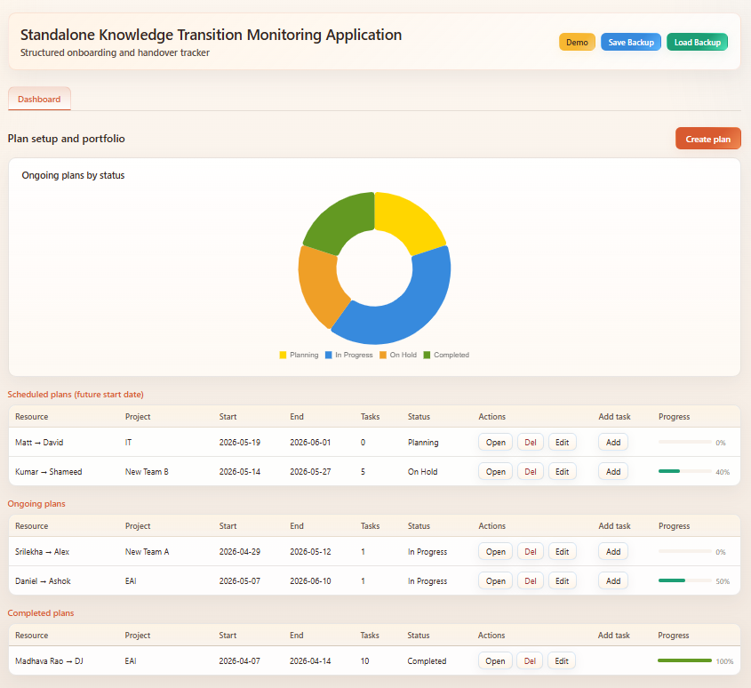

# Knowledge Transition Plan Tracker

A standalone browser-based HTML application for planning and tracking structured knowledge transitions. It is designed for onboarding, handovers, and ownership transfer scenarios where teams need clear week-by-week tracking, task visibility, and simple backup/restore support.

## Overview

The application runs fully in the browser with no backend and no build step. It stores data locally and allows export/import of plan data for portability.

## Key capabilities

- Create transition plans for 1 to 8 weeks.
- Weekday-only scheduling logic (Monday to Friday).
- Edit and delete plans.
- Manage week descriptions with suggested or custom text.
- Track tasks by status and phase/week.
- View day-by-day task progress (weekends excluded).
- Visualize progress with charts.
- Use demo mode to load sample workflow data.
- Export and import full backups in JSON format.
- Export a portable HTML plan summary.

## Project structure

- `Resource_transition_plan_tracker.html`: Main application UI, styling, and JavaScript logic.
- `README.md`: Project documentation.
- `AGENTS.md`: Repository-level guidance for contributors and coding agents.
- `image/`: Screenshots used in documentation.
- `Design/`: Design artifacts.
- `Presentation/`: Presentation materials.

## Screenshots

  
    
  
    
  
    
  

## Quick start

1. Open `Resource_transition_plan_tracker.html` in a modern browser.
2. Create a new transition plan with owner details, project details, and duration.
3. Update weekly descriptions if needed.
4. Add and manage tasks from the plan dashboard.
5. Use Demo to preview sample behavior.
6. Use Save Backup and Load Backup to move or restore all plan data.
7. Use Export Plan to generate a shareable HTML summary.

## Data and persistence

- Plan and tracker data are stored in browser `localStorage`.
- Backups are exported/imported as JSON.
- No server-side storage is used.

## Validation guide

There is no automated test framework configured for this standalone HTML app. Recommended validation is manual smoke testing.

### Happy path

- Create a 2-week plan and confirm only 10 weekdays are generated.
- Add tasks and confirm counts update on the dashboard.
- Edit an existing plan and confirm values persist.
- Run Demo and verify scheduled, ongoing, and completed examples appear.

### Edge cases

- Change duration from 1 to 8 weeks and verify weekday-based end-date updates.
- Override a suggested week description with custom text and save.
- Confirm task phase/week options are limited to generated weeks.
- Confirm day-by-day tracker excludes Saturday and Sunday.

### Error handling

- Save a plan with missing required fields and verify validation appears.
- Enter an end date earlier than start date and verify validation appears.
- Add a task without a task name and verify validation appears.

## Known limitations

- Data is browser-local unless exported.
- Clearing browser storage removes unsaved local data.
- Multi-user collaboration is not supported in this standalone version.

## Author

DJ Rajasekar  
LinkedIn: [https://www.linkedin.com/in/rajasekar-dj](https://www.linkedin.com/in/rajasekar-dj)  
GitHub: [https://github.com/djrajasekar](https://github.com/djrajasekar)
